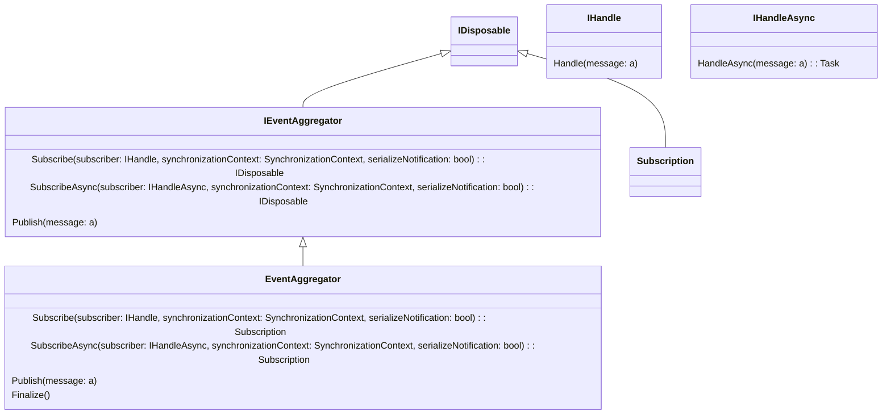

# event-aggregation

A simple event aggreator, that eases subscription and publishing of typed events. 

[Same documentation for C# programmers](README.CS.md)

The main objectives for the library is to:

* Facilitate a simple event aggregator, to which:
  * Subscribers implementing either synchronous or asynchronous consumption can subscribe to published event
  * Publishers can out of band publish messages to subscribers
* Utilizing loose coupling. This is done by:
  * Having the event aggregator not holding on to subscribers. The event aggregator does this via weak references, such that subscribers can go away silently
  * Utilizing TPL dataflow action blocks to act as mail boxes for messages
* Let subscribers determine whether they want to receive messages in order or not. This is done be configuring the TPL dataflow action blocks' level of parallelism
* Let subscribers determine whether they want to be notified as direct calls or inside a provided ``SynchronizationContext``

The library has an object-oriented side and a functional side, meant for idiomatic F#

## The object oriented side

The object oriented part of this small library consists of:

* Three interfaces
* Two types implementing one of the interfaces and also ``IDisposable``




The interfaces and some of the classes are actual generic on the type of message to publish via the event-aggregator:

* ``IHandle<'a>`` is a generic interface with a single method:
  * ``Handle(message: 'a)``. This interface is implemented by subscribers who want to be notified with messages of type ``'a`` synchronously
* ``IHandleAsync<'a>`` is a generic interface with a single method:
  * ``HandleAsync(message: 'a)``. This interface is implemented by subscribers who want to be notified with messages of type ``'a`` asynchronously
* ``IEventAggregator<'a>`` is a generic interface, that consumes either ``IHandle<'a>`` or ``IHandleAsync<'a>`` when subscription occurs (``Subscribe`` or ``SubscribeAsync``) and messages of type ``'a`` when publishing. Subscribing returns an ``IDisposable``, which is actually a ``Subscription``, which upon disposal will remove the subscription from the event aggregator

But generics are difficult or impossible for now to render in the above

Simple usage is:

* Create an instance of an event aggregator. Keep it around till it's not needed anymore.
* Create appropriate instances of subscribers - that is instances of types, that inherit from either ``IHandle<'a>`` or ``IHandleAsync<'a>``. 
* Have the various subscribers subscribe appripriately:
  * If a synchronization context is required - ie. UI components - provide a valid ``SynchronizationContext``
  * Decide whether messages should be sent in order or not: that is the last boolean flag in the subscribe methods.
* When subscribers go away, consider disposing of the subscription. This will eventually happen later during finalization if this is forgotten.
* When the event aggregator is no longer needed, dispose it. If forgotten, the finalizer will take care of it

## The functional library

The functional library sits on top of the above, and adds support for two more types of asynchronous subscription:

* Via the ``task`` computational expression, which is a late comer in F# - auto started tasks
* Via the classical ``async`` computational expression.

The thing is implemented via a lot of small types, but use can be of the style:

```fsharp
    use eventAggregator : IEventAggregator<MyMessage> = createEventAggregator()
    ...
    let syncSubscriber (message: MyMessage) = // Plain function
        ....
        ()
    let syncSubscriber : Subscriber<MyMessage> = syncSubscriber // Using shadowing. There is also a function called syncSubscriber with same purpose. This is just implicit operators on some discriminated union
    let syncSubscriber : Arg<MyMessage> = syncSubscriber // Shadow again... Same as above
    let sc = SynchronizationContext() // Just to show the use
    let syncSubscriber = syncSubscriber |> |> withSynchronizationContext sc |> withSerializationOfNotifications true
    subscribe syncSubscriber eventAggregator

    // Or with a classical .Net async
    let taskSubscriber (message: MyMessage) =
        ...
        Task.CompletedTask
    // And then similar to above

    // Or with a classical .Net async
    let taskComputationalExpressionSubscriber (message: MyMessage) =
        task {
            ....
            ()
        }
    // And then similar to above

    // Or with a classical .Net async
    let asyncSubscriber (message: MyMessage) =
        async {
            ....
            ()
        }
    // And then similar to above
```